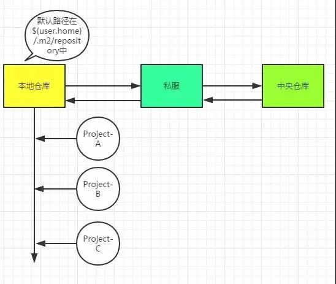
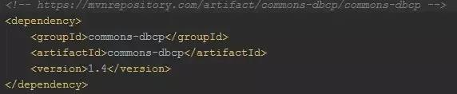
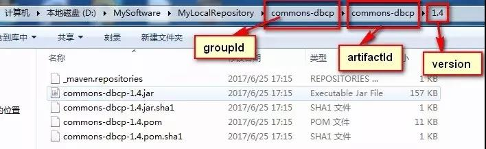
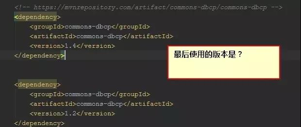
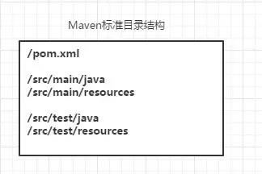
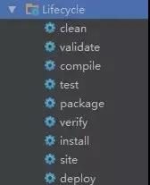

前言

在如今的互联网项目开发当中，特别是Java领域，可以说Maven随处可见。Maven的仓库管理、依赖管理、继承和聚合等特性为项目的构建提供了一整套完善的解决方案，可以说如果你搞不懂Maven，那么一个多模块的项目足以让你头疼，依赖冲突就会让你不知所措，甚至搞不清楚项目是如何运行起来的.....OK，博主就曾经被Maven“伤害”过，那么该专题的目的就是：彻底搞定Maven！

回想一下，当你新到一家公司，安装完JDK后就会安装配置Maven（MAVEN_HOME、path），很大可能性你需要修改settings.xml文件，比如你会修改本地仓库地址路径，比如你很可能会copy一段配置到你的settings.xml中（很可能就是私服的一些配置）。接下来，你会到IDEA或者Eclipse中进行Maven插件配置，然后你就可以在工程中的pom.xml里面开始添加<dependency>标签来管理jar包，在Maven规范的目录结构下进行编写代码，最后你会通过插件的方式来进行测试、打包（jar or war）、部署、运行。

上面描述了我们对Maven的一些使用方式，下面我们进行一些思考：

Q1：本地仓库？Maven到底有哪些仓库？它们什么关系？

Maven仓库

本地仓库路径配置

你要jar包，不可能每次都要联网去下载吧，多费劲，所以本地仓库就是相当于加了一层jar包缓存，先到这里来查。如果这里查不到，那么就去私服上找，如果私服也找不到，那么去中央仓库去找，找到jar后，会把jar的信息同步到私服和本地仓库中。

私服，就是公司内部局域网的一台服务器而已，你想一下，当你的工程Project-A依赖别人的Project-B的接口，怎么做呢？没有Maven的时候，当然是copy Project-B jar到你的本地lib中引入，那么Maven的方式，很显然需要其他人把Project-B deploy到私服仓库中供你使用。因此私服中存储了本公司的内部专用的jar！不仅如此，私服还充当了中央仓库的镜像，说白了就是一个代理！

中央仓库：该仓库存储了互联网上的jar，由Maven团队来维护，地址是：http://repo1.maven.org/maven2/。

Q2：关于<dependency>的使用

依赖管理

其实这个标签揭示了jar的查找坐标：groupId、artifactId、version。

一般而言，我们可以到私服上输入artifactId进行搜索，或者到http://search.maven.org/、http://mvnrepository.com/上进行查找确定坐标。

version分为开发版本（Snapshot）和发布版本（Release），那么为什么要分呢？

在实际开发中，我们经常遇到这样的场景，比如A服务依赖于B服务，A和B同时开发，B在开发中发现了BUG，修改后，将版本由1.0升级为2.0，那么A必须也跟着在POM.XML中进行版本升级。过了几天后，B又发现了问题，进行修改后升级版本发布，然后通知A进行升级...可以说这是开发过程中的版本不稳定导致了这样的问题。

Maven，已经替我们想好了解决方案，就是使用Snapshot版本，在开发过程中B发布的版本标志为Snapshot版本，A进行依赖的时候选择Snapshot版本，那么每次B发布的话，会在私服仓库中，形成带有时间戳的Snapshot版本，而A构建的时候会自动下载B最新时间戳的Snapshot版本！

Q3：既然Maven进行了依赖管理，为什么还会出现依赖冲突？处理依赖冲突的手段是？

首先来说，对于Maven而言，同一个groupId同一个artifactId下，只能使用一个version！

根据上图的依赖顺序，将使用1.2版本的jar。

现在，我们可以思考下了，比如工程中需要引入A、B，而A依赖1.0版本的C，B依赖2.0版本的C，那么问题来了，C使用的版本将由引入A、B的顺序而定？这显然不靠谱！如果A的依赖写在B的依赖后面，将意味着最后引入的是1.0版本的C，很可能在运行阶段出现类（ClassNotFoundException）、方法（NoSuchMethodError）找不到的错误（因为B使用的是高版本的C）！

这里其实涉及到了2个概念：依赖传递（transitive）、Maven的最近依赖策略。

依赖传递：如果A依赖B，B依赖C，那么引入A，意味着B和C都会被引入。

Maven的最近依赖策略：如果一个项目依赖相同的groupId、artifactId的多个版本，那么在依赖树（mvn dependency:tree）中离项目最近的那个版本将会被使用。（从这里可以看出Maven是不是有点小问题呢？能不能选择高版本的进行依赖么？据了解，Gradle就是version+策略）

现在，我们可以想想如何处理依赖冲突呢？

想法1：要使用哪个版本，我们是清楚的，那么能不能不管如何依赖传递，都可以进行版本锁定呢？

使用<dependencyManagement>  [这种主要用于子模块的版本一致性中]

想法2：在依赖传递中，能不能去掉我们不想依赖的？

使用<exclusions> [在实际中我们可以在IDEA中直接利用插件帮助我们生成]

想法3：既然是最近依赖策略，那么我们就直接使用显式依赖指定版本，那不就是最靠近项目的么？

使用<dependency>

Q4：引入依赖的最佳实践，提前发现问题！

在工程中，我们避免不了需要加一些依赖，也许加了依赖后运行时才发现存在依赖冲突在去解决，似乎有点晚！那么能不能提前发现问题呢？

如果我们新加入一个依赖的话，那么先通过mvn dependency:tree命令形成依赖树，看看我们新加入的依赖，是否存在传递依赖，传递依赖中是否和依赖树中的版本存在冲突，如果存在多个版本冲突，利用上文的方式进行解决！

Q5：Maven规范化目录结构

简单Java工程目录结构

这里需要注意2点：

第一：src/main下内容最终会打包到Jar/War中，而src/test下是测试内容，并不会打包进去。
第二：src/main/resources中的资源文件会COPY至目标目录，这是Maven的默认生命周期中的一个规定动作。（想一想，hibernate/mybatis的映射XML需要放入resources下，而不能在放在其他地方了）

Q6：Maven的生命周期

Maven生命周期

我们只需要注意一点：执行后面的命令时，前面的命令自动得到执行。

实际上，我们最常用的就是这么几个：
clean：有问题，多清理！
package：打成Jar or War包，会自动进行clean+compile
install：将本地工程Jar上传到本地仓库
deploy：上传到私服

Q7：关于scope依赖范围

既然，Maven的生命周期存在编译、测试、运行这些过程，那么显然有些依赖只用于测试，比如junit；有些依赖编译用不到，只有运行的时候才能用到，比如mysql的驱动包在编译期就用不到（编译期用的是JDBC接口），而是在运行时用到的；还有些依赖，编译期要用到，而运行期不需要提供，因为有些容器已经提供了，比如servlet-api在tomcat中已经提供了，我们只需要的是编译期提供而已。

总结来说：
compile：默认的scope，运行期有效，需要打入包中。
provided：编译期有效，运行期不需要提供，不会打入包中。
runtime：编译不需要，在运行期有效，需要导入包中。（接口与实现分离）
test：测试需要，不会打入包中。
system：非本地仓库引入、存在系统的某个路径下的jar。（一般不使用）